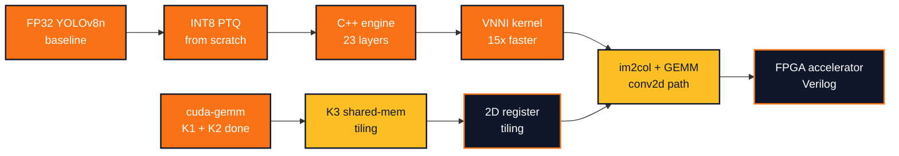

 

## About

Computer Engineering student at UC Irvine, working on **efficient AI inference for embedded hardware**.

I was an undergraduate researcher at UCI's **Calit2 Computer Vision Lab** (wildfire detection) and am currently a **Controls Systems Engineer on UCI HyperXite** (Hyperloop). I'm building toward getting neural networks to run fast and correctly on constrained hardware. Embedded systems give me the hardware discipline (bare-metal STM32, FreeRTOS, register-level control), and AI inference with quantization is where I apply it (INT8 PTQ, custom C++ inference engines, CUDA kernel optimization).

## Featured Projects

### 🔥 Custom INT8 Quantization and C++ Inference Engine for YOLOv8n

> Custom INT8 inference engine for YOLOv8n fire/smoke detection, written from scratch in C++.

- Built the whole inference pipeline by hand in C++, from the convolution math up to drawing labelled boxes on the photo, without using a machine learning library
- Wrote the compression math from first principles instead of calling a library function, taking the model from 32-bit decimals to 8-bit integers, four times smaller, while keeping 99.6% of the original detection accuracy (0.8826 vs 0.8859 mAP)
- Vectorized the convolution around the processor's 8-bit dot product instruction, 15x faster and byte-for-byte identical to the plain loop

 

### ⚡ cuda-gemm-from-scratch

> CUDA GEMM kernels built from naive to optimized, targeted at eventual integration into the inference engine's conv2d path via im2col.

- Kernels 1 (naive) and 2 (coalesced) complete on T4
- Kernel 3 (shared memory tiling) in progress
- Benchmarked against cuBLAS as the reference ceiling

 

### 🚄 HyperXite Controls (STM32 / FreeRTOS)

> Real-time controls firmware for UCI's Hyperloop pod.

- FreeRTOS on STM32 with multi-priority tasks
- UART telemetry pipeline for live pod state
- Register-level HAL work for peripheral drivers

 

### 📡 STM32F446RE Bare-Metal Proximity Alert System

> Ultrasonic distance sensor driving a three-LED threshold indicator, written entirely against the STM32F446RE's memory-mapped registers with zero HAL dependency.

- Direct register manipulation for GPIO configuration (MODER, BSRR) and peripheral clock gating (AHB1ENR), no CubeMX-generated init code
- Hardware timer (TIM CNT) captures HC-SR04 echo pulse width for microsecond-resolution distance measurement
- Three-tier LED threshold logic driven off the computed distance, exercising the full sensor to compute to actuate loop without abstraction layers

 

### ⚙️ RISC-V Single-Cycle Processor (Verilog)

> A working 32-bit RISC-V processor designed from scratch in Verilog and verified in simulation.

- Designed the actual circuitry of a computer processor, the part that reads instructions and does the work a program asks for
- Built each piece by hand and wired them together: the arithmetic unit, the memory, the registers, and the control logic that decides what every instruction does
- Verified the design by simulating a 20-instruction test program and confirming the processor produced the correct result at every single step

 

### 🛰️ FRND (IrvineHacks 2026)

> Disaster mesh network with an on-device LLM chat assistant.

- SmolLM2-135M running via llama.cpp on Arduino UNO Q
- Mesh routing for offline peer-to-peer messaging
- Fully on-device inference, no cloud dependency

## Tech Stack

**Languages**

**AI / Inference**

**Embedded / Systems**

## Currently Working On

- Kernel 3 of cuda-gemm-from-scratch (shared memory tiling), then a 2D register-tiled kernel
- Wiring an im2col + GEMM path into custom engine's conv2d to replace the reference loops
- HyperXite pod controls firmware for the next competition cycle

## Contact

